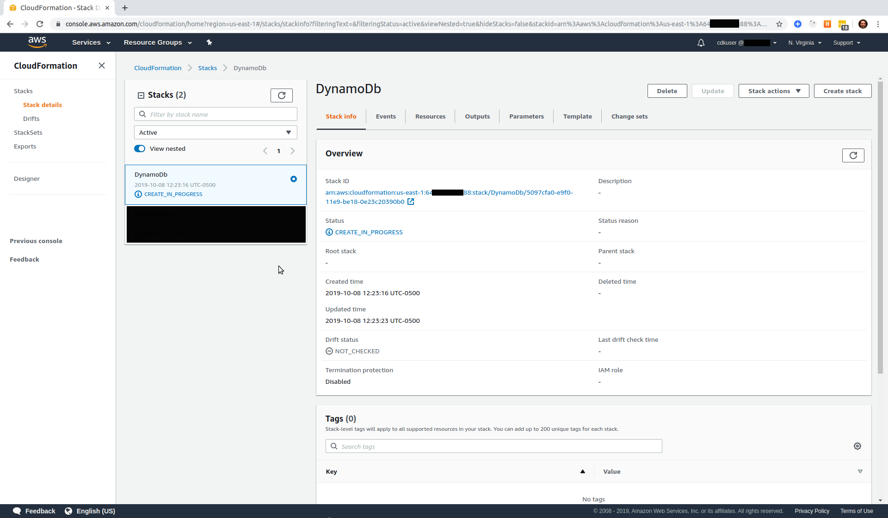
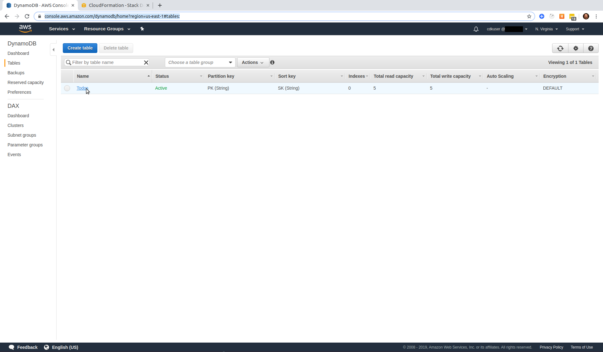

# A Serverless Project

Brought to you by [Dozen Software](dozensoft.com)

## Blog Post #2 - DynamoDb

DynamoDb is AWS's NoSQL database service. [Here is AWS's overview](https://aws.amazon.com/dynamodb/).

For this project, I'll be using DynamoDb to persist data. There are other options, like [RDS](https://aws.amazon.com/rds/), or running an [EC2](https://aws.amazon.com/ec2/) instance with MySQL or Postgres. But I chose DynamoDb for its ease of infrastructure management, its speed, and its low cost.

Please be sure you've completed everything in [step 1](../01) before proceeding.

## Steps

1. [CDK Code for DynamoDb](#cdk-code-dynamodb)
1. [CDK Code for the project](#cdk-code-project)
1. [Build and Synth](#build-and-synth)
1. [Deploy](#deploy)
1. [Auto Scaling](#auto-scaling)
1. [Re-Deploy](#re-deploy)
1. [Conclusion](#conclusion)

### Step 1: CDK Code for DynamoDb <a name="cdk-code-dynamodb"></a>

The first thing I want to do is create my DynamoDb table. And for that, I'll need to install AWS's DynamoDb CDK npm package, like so...

```sh
cd cdk
npm i @aws-cdk/aws-dynamodb
```

Then I'll create a new file: `cdk/lib/dynamodb.ts` with the following in it.

```js
import cdk = require("@aws-cdk/core");
import dynamodb = require("@aws-cdk/aws-dynamodb");

export class DynamoDb extends cdk.Stack {
  constructor(scope: cdk.Construct, id: string, props?: cdk.StackProps) {
    super(scope, id, props);

    const table = new dynamodb.Table(this, "Todos", {
      tableName: "Todos",
      partitionKey: { name: "PK", type: dynamodb.AttributeType.STRING },
      sortKey: { name: "SK", type: dynamodb.AttributeType.STRING }
    });
  }
}
```

If you compare this file to the `cdk/lib/cdk-stack.ts` file that was auto generated, you'll see that the only additions are the `import dynamodb` statement and the `const table = new dynamodb.Table...` statement. That's all you have to do to define your data store!

To read more about AWS's DynamoDb CDK npm package, [here is a link to the documentation](https://docs.aws.amazon.com/cdk/api/latest/docs/aws-dynamodb-readme.html).

### Step 2: CDK Code for the project <a name="cdk-code-project"></a>

The entry point for our CDK project is the `cdk/bin/cdk.ts` file. I need to import my newly created `dynamodb.ts` file and instantiate a new instance of that class.

```js
#!/usr/bin/env node
import "source-map-support/register";
import cdk = require("@aws-cdk/core");
import { DynamoDb } from "../lib/dynamodb";

const env = { region: "us-east-1" };

const app = new cdk.App();
new DynamoDb(app, "DynamoDb", { env });
```

You'll see that I also removed the `CdkStack` references. We don't need those.

### Step 3: Build and Synth <a name="build-and-synth"></a>

Make sure you're still in your `cdk` directory and run this command:

```sh
npm run build
```

This simply compiles your typescript down to javascript.

Then run

```sh
cdk synth
```

This will run the javascript code to generate a CloudFormation template.
A CloudFormation template is a long-form description of an AWS project's infrastructure. The CDK is a layer of abstraction on top of CloudFormation. This is important to understand when troubleshooting, since you can (sometimes) go into your [CloudFormation Console](https://console.aws.amazon.com/cloudformation/home) to get more information when a CDK task goes awry. [Here is more info about CloudFormation](https://aws.amazon.com/cloudformation/)

For the rest of this blog series, I will combine these two commands and just run

```sh
npm run build && cdk synth
```

### Step 4: Deploy <a name="deploy"></a>

```sh
cdk deploy
```

This will send your generated CloudFormation template to AWS, using the credentials that you setup in [Step 4 of the first Blog Post](../01#setup-cli).

The output should look something like this...

```
DynamoDb: deploying...
DynamoDb: creating CloudFormation changeset...
 0/3 | 12:23:26 PM | CREATE_IN_PROGRESS   | AWS::CDK::Metadata   | CDKMetadata
 0/3 | 12:23:26 PM | CREATE_IN_PROGRESS   | AWS::DynamoDB::Table | Todos (Todos4F51CAC2)
 0/3 | 12:23:27 PM | CREATE_IN_PROGRESS   | AWS::DynamoDB::Table | Todos (Todos4F51CAC2) Resource creation Initiated
 0/3 | 12:23:28 PM | CREATE_IN_PROGRESS   | AWS::CDK::Metadata   | CDKMetadata Resource creation Initiated
 1/3 | 12:23:28 PM | CREATE_COMPLETE      | AWS::CDK::Metadata   | CDKMetadata
 2/3 | 12:23:57 PM | CREATE_COMPLETE      | AWS::DynamoDB::Table | Todos (Todos4F51CAC2)
 3/3 | 12:23:59 PM | CREATE_COMPLETE      | AWS::CloudFormation::Stack | DynamoDb

 ✅  DynamoDb

Stack ARN:
arn:aws:cloudformation:us-east-1:64REDACTED88:stack/DynamoDb/5097cfa0-e9f0-11e9-be18-0e23c20390b0
```

And if you visit the [CloudFormation Console](https://console.aws.amazon.com/cloudformation/home), you should see something like this:


And now you have a DynamoDb table in your account. Visit [DynamoDb in the AWS Console](https://console.aws.amazon.com/dynamodb/home?region=us-east-1#tables:) to see it. It should look something like this:


### Step 5: Auto Scaling <a name="auto-scaling"></a>

DynamoDb has a nifty new(ish) feature called auto scaling. Basically, it means you don't have to guess at your provisioned capacity - AWS will just adjust it for you as the demand increases or decrease. If that doesn't make sense, don't worry about it. [Or do](https://docs.aws.amazon.com/amazondynamodb/latest/developerguide/AutoScaling.html). It's not essential for this blog series. But I am going to add some code to my `cdk/lib/dynamodb.ts` file after the `new dynamodb.Table...` declaration.

```js
const readScaling = table.autoScaleReadCapacity({
  minCapacity: 1,
  maxCapacity: 50
});

const writeScaling = table.autoScaleWriteCapacity({
  minCapacity: 1,
  maxCapacity: 50
});

readScaling.scaleOnUtilization({
  targetUtilizationPercent: 70
});

writeScaling.scaleOnUtilization({
  targetUtilizationPercent: 70
});
```

This basically says that I'm willing for the table to be scaled up to 50 capacity units for read and/or write. And please aim to keep the utilization at around 70%.

### Step 6: Re-deploy <a name="re-deploy"></a>

We already have our table. But now we've made a change to it in the code. We need to deploy those changes.
The way you do that is exactly the same as if you were deploying it for the first time

```sh
npm run build && cdk synth
cdk deploy
```

The difference is that the CDK (or maybe CloudFormation) will see that your table already exists, and it will only deploy a [changeset](https://docs.aws.amazon.com/AWSCloudFormation/latest/UserGuide/using-cfn-updating-stacks-changesets.html). This way you don't have to wait for everything to be re-built any time you want to make a change. We only have one table now, so it's not a big deal. But once you have a bunch of resources, this will make a large difference.

### Conclusion <a name="conclusion"></a>

Now you have built a DynamoDb table that autoscales. And its definition is written in code and can be deployed in anyone's AWS account.

As I said in the first blog post, I hope this made sense. But if not, hit me up on [twitter](https://twitter.com/murribu), or file an issue/pr on this repo.

If you made it all the way through, you're ready for [Step 3](../03)
