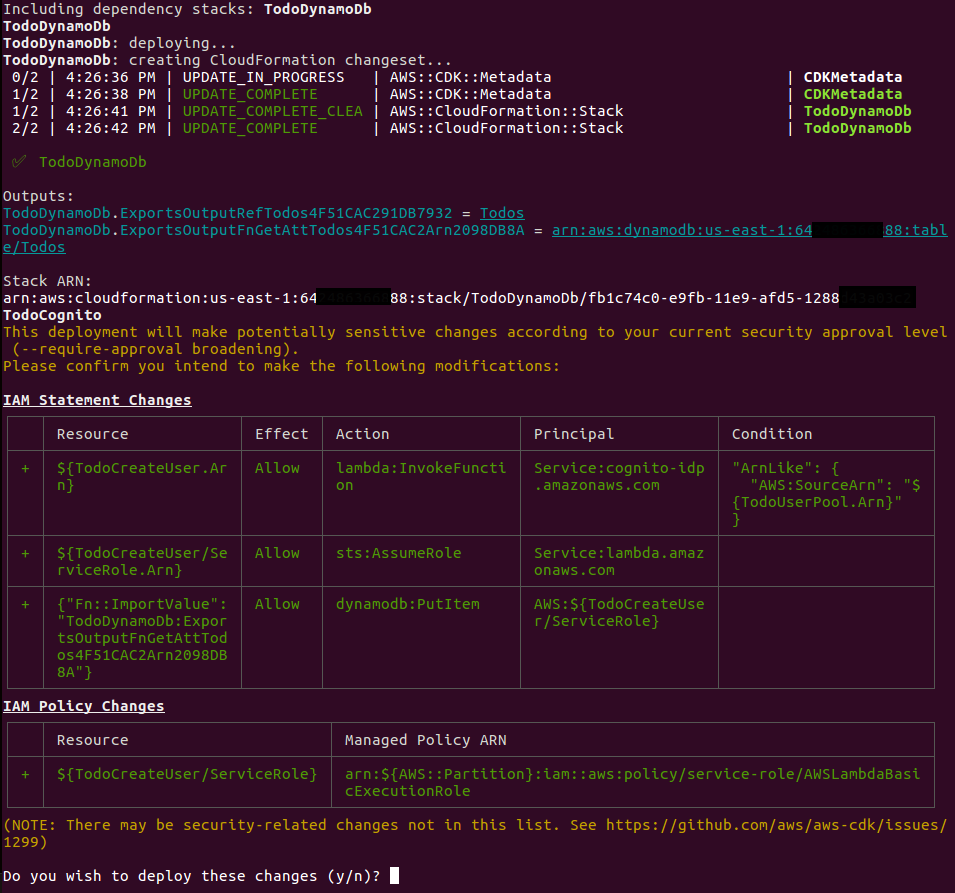
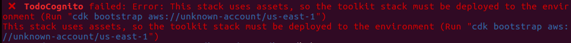

# A Serverless Project

## Blog Post #4 - Lambda

Lambda is an AWS compute service that lets you run code without provisioning or managing servers. [More info](https://aws.amazon.com/lambda/)

I'd like to write an entry to my DynamoDb table any time a user signs up and then validates their email address. Do do this, I'm going to use Lambda and [Cognito Events](https://docs.aws.amazon.com/cognito/latest/developerguide/cognito-events.html).

I'd also like to capture some custom data when a user signs up. Specifically, their first name and last name.

As always, you can skip over all of this by just copying the directory into your project

```sh
cd ~/projects
rm -rf my-cdk-project/*
cp -R serverless-cdk-cicd/04/. my-cdk-project/
```

But if you want an explanation, here are the steps I took

## Steps

1. [Add custom attributes to the Cognito UserPool](#custom-attributes)
1. [Write the lambda](#write-lambda)
1. [Pass the DynamoDb table name to the Cognito Stack](#pass-table-name)
1. [Connect the new lambda to the Cognito UserPool](#connect-lambda)
1. [Deploy all the things](#deploy)
1. [Conclusion](#conclusion)

### Step 1: Add custom attributes to the Cognito UserPool

In the `cdk/lib/cognito.ts` file, you can hook custom attributes onto the `cfnUserPool`'s schema like so:

```js
cfnUserPool.schema = [
  {
    attributeDataType: "String",
    developerOnlyAttribute: false,
    mutable: true,
    name: "first_name",
    required: false,
    stringAttributeConstraints: {
      maxLength: "255",
      minLength: "1"
    }
  }
];
```

I just repeated this for `first_name` and `last_name`.

### Step 2: Write the lambda

I'm going to create an `assets` folder under my `cdk` folder to hold things that my CDK code needs to reference. And then a `lambda` folder under that to hold the lambda things. And then a `createuser` folder to hold the lambda code for the new lambda that I'm going to write.

```sh
cd cdk
mkdir -p assets/lambda/createuser
```

We're going to use the [aws-sdk npm package](https://aws.amazon.com/sdk-for-node-js/) to interact with our DynamoDb table. So let's initialize our new npm project and import our needed dependencies

```sh
cd assets/lambda/createuser
npm init
npm i aws-lambda aws-sdk @types/aws-lambda @types/node
touch index.ts
```

This lambda file will take an `event` and a `context` as its parameters.

<details><summary>If you care what the event object looks like, click here</summary>
<p>

```json
{
  "version": "1",
  "region": "us-east-1",
  "userPoolId": "us-east-1_3wOBLABLA",
  "userName": "28c59d66-bc43-4610-977a-EXAMPLE",
  "callerContext": {
    "awsSdkVersion": "aws-sdk-unknown-unknown",
    "clientId": "1qenmfp3eoct4ojak93EXAMPLE"
  },
  "triggerSource": "PostConfirmation_ConfirmSignUp",
  "request": {
    "userAttributes": {
      "sub": "28c59d66-bc43-4610-977a-EXAMPLE",
      "custom:last_name": "Doe",
      "cognito:email_alias": "jdoe@example.com",
      "cognito:user_status": "CONFIRMED",
      "email_verified": "true",
      "custom:first_name": "John",
      "email": "jdoe@example.com"
    }
  },
  "response": {}
}
```

</p>
</details>

So, we'll need look at the event and put the relevant pieces in our DynamoDB table.

Here's how we do that.

```js
import * as lambda from "aws-lambda";
import * as AWS from "aws-sdk";

exports.handler = async (event: any, serverlessContext: lambda.Context) => {
  const dynamoClient = new AWS.DynamoDB({ apiVersion: "2012-08-10" });
  const date = new Date();
  const dateAsIso = date.toISOString();
  const TableName: string = process.env.DYNAMODBTABLE || "";
  const ConditionExpression = "attribute_not_exists(PK)";
  try {
    const Item = {
      PK: { S: "user" + event.request.userAttributes["sub"] },
      SK: { S: "user#" + dateAsIso },
      firstName: event.request.userAttributes["custom:first_name"],
      lastName: event.request.userAttributes["custom:last_name"],
      email: event.request.userAttributes["email"]
    };
    const data = await dynamoClient.transactWriteItems({
      TransactItems: [{ Put: { Item, TableName, ConditionExpression } }]
    });
  } catch (error) {
    console.log({ statusCode: 400, error });
  }

  return event;
};
```

You can see that I'm getting the `TableName` from `process.env` variable. Stay tuned for more on that.
Also, I'm unncessarily using the `transactWriteItems` call. Since I'm only putting one row in the table, I don't need a transaction. But I've left it here in case I want to add another UPDATE or PUT later.
Cognito creates a unique identifier called `sub` for each user that signs up in your UserPool. I'm using that in combination with the literal string "user" as the Primary Key value for our new row. And the Sort Key will be "user#" plus the current DateTime.

### Step 3: Pass the DynamoDb table name to the Cognito Stack <a name="pass-table-name"></a>

The CDK allows for one Stack to feed data to another stack via its `props`.

For this project, we need the Cognito Stack (which will contain our lambda function) to know what name we gave our DynamoDb table. First, we need to establish a class variable in our `cdk/lib/dynamodb.ts` file. And then we'll assign the table that we're creating to that class variable instead of a `const`. Compare `cdk/lib/dynamodb.ts` in [Step 3](../03/cdk/lib/dynamodb.ts) to [the version in this step](cdk\lib\dynamodb.ts) to see what I mean.

Then we can tell our Cognito stack to expect some DynamoDb info as its props in our `cdk/lib/cognito.ts` file.

```js
import cdk = require("@aws-cdk/core");
import cognito = require("@aws-cdk/aws-cognito");
import dynamodb = require("@aws-cdk/aws-dynamodb");

interface PropsFromDynamoDb {
  table: dynamodb.Table;
}

interface CognitoProps {
  dynamodb: PropsFromDynamoDb;
  stackProps: cdk.StackProps;
}

export class Cognito extends cdk.Stack {
  constructor(scope: cdk.Construct, id: string, props: CognitoProps) {
    super(scope, id, props.stackProps);
...
```

Finally, we need to update our `cdk/bin/cdk.ts` file to actually pass the info from the DynamoDb stack to the Cognito Stack.

```js
...
const dynamodb = new DynamoDb(app, "TodoDynamoDb", { env });
new Cognito(app, "TodoCognito", { stackProps: { env }, dynamodb });
```

### Step 4: Connect the new lambda to the Cognito UserPool <a name="connect-lambda"></a>

First we'll install the new dependencies that we need:

```sh
cd cdk
npm i @aws-cdk/aws-iam @aws-cdk/aws-lambda
```

Next, we'll create the lambda in our `cdk/lib/cognito.ts` file.

```js
const fnCreateUser = new lambda.Function(this, "TodoCreateUser", {
  runtime: lambda.Runtime.NODEJS_10_X,
  handler: "src/index.handler",
  code: lambda.Code.asset("./assets/lambda/createuser"),
  environment: {
    DYNAMODBTABLE: props.dynamodb.table.tableName
  },
  timeout: cdk.Duration.seconds(30)
});
```

You can see that this passes the DynamoDb table name into the lambda as an environment variable. Also, it references the `assets/lambda/createuser` folder - to package it up for deployment. And we want to run the `handler` function inside the `index.js` file (which will have been compiled from our `index.ts` file when we run `npm run build`).

Then we just register that lambda as the userpool's PostConfirmationTrigger.

```js
userpool.addPostConfirmationTrigger(fnCreateUser);
```

Now, creating that lambda will automatically generate a role. And we need to make sure that role can write to the DynamoDb table. So we have to do some IAM stuff here.

```js
  const createUserLambdaRole = fnCreateUser.role as iam.Role;

  const policyDynamoTable = new iam.Policy(this, "ToDoPolicyLambdaToDynamo", {
    policyName: "ToDoPolicyLambdaToDynamo"
  });

  const policyStatement = new iam.PolicyStatement({
    effect: iam.Effect.ALLOW,
    resources: [props.dynamodb.table.tableArn],
    actions: [
      "dynamodb:PutItem",
    ]
  });

  policyDynamoTable.addStatements(policyStatement);

  createUserLambdaRole.attachInlinePolicy(policyDynamoTable);
```

Here, we grabbed a reference to the auto-generated role, and attached an inline policy to let the lambda `Put` items in our DynamoDb table.

### Step 5: Deploy all the things <a name="deploy"></a>

We've updated two stacks and we want to deploy them both. There are two ways to go about this. We could use a wildcard to reference all of our stacks.

```sh
cd cdk
npm run build && cdk synth
cdk deploy Todo*
```

OR

Since the Cognito stack is now dependent on the DynamoDb stack, we can merely deploy the Cognito stack. The CDK will see the dependency and make sure that the DynamoDb stack is deployed and up-to-date before deploying the Cognito stack.

```sh
cd cdk
npm run build && cdk synth
cdk deploy TodoCognito
```

Since there are security changes in our deployment, you will be given an "Are you sure?" prompt that will look something like this:


Or you can add the `--require-approval never` parameter, and the CDK will forego this check.

Also, if you get an error that looks something like this


You can run the following command to resolve it:

```sh
cdk bootstrap aws://64REDACTED88/us-east-1
```

(You'll need to paste in your own AWS account number instead of `64REDACTED88`)

[Here's more info](https://github.com/aws/aws-cdk/issues/3091)

### Conclusion <a name="conclusion"></a>

You should now be able to click around in your [Cognito Console](https://console.aws.amazon.com/cognito/users/?region=us-east-1), [Lambda Console](https://console.aws.amazon.com/lambda/home?region=us-east-1#/functions), and [DynamoDb Console](https://console.aws.amazon.com/dynamodb/home?region=us-east-1#tables:) and see all of your shiny new resources.

If anything is unclear, @ me on [twitter](https://twitter.com/murribu) or file an issue/pr on this repo.
