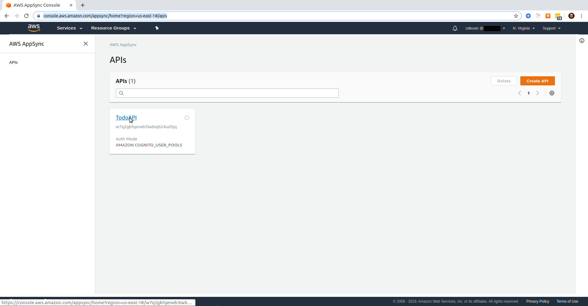
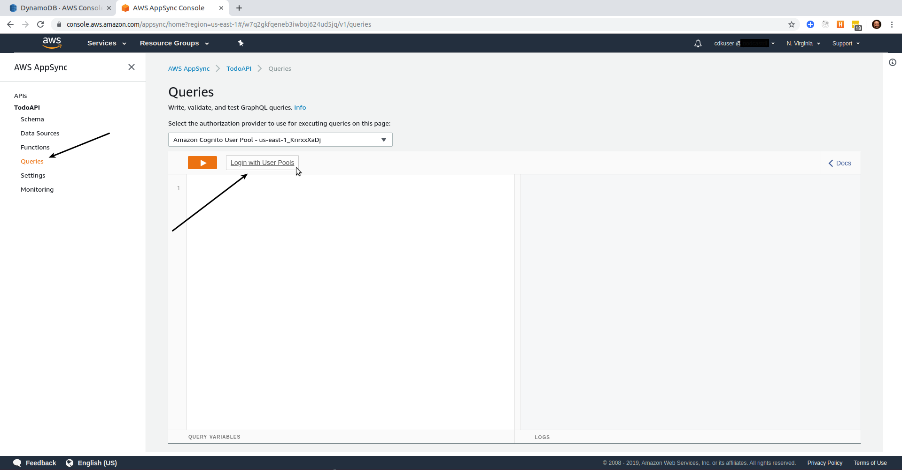
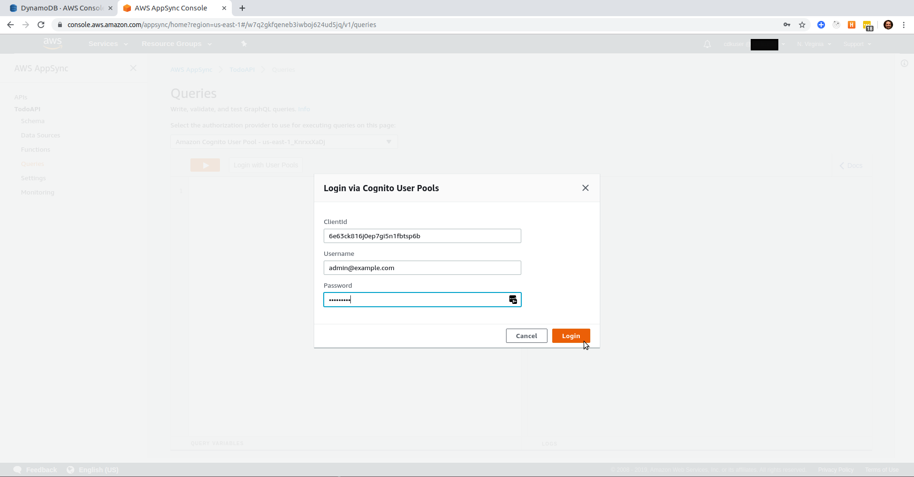
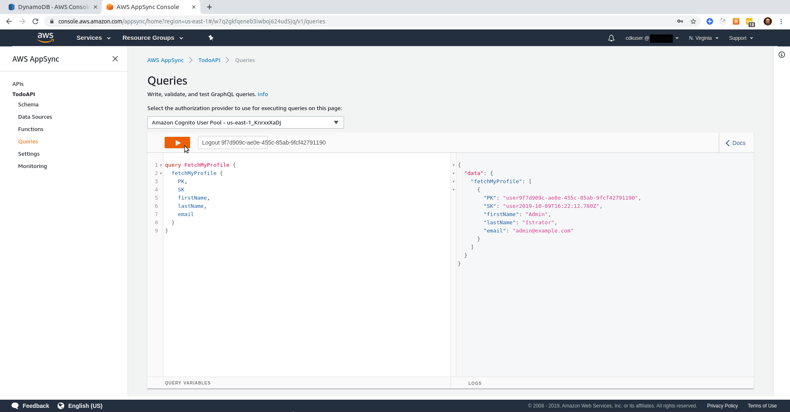

# A Serverless Project

Brought to you by [Dozen Software](https://dozensoft.com/)

## Blog Post #6 - Appsync

Appsync is AWS's managed GraphQL API service. If you're familiar with API Gateway, Appsync is very similar, but it is a GraphQL implementation instead of a RESTful implementation. [More info](https://aws.amazon.com/appsync/)

We will need an API for our front end to communicate to our data layer.

If you want to skip over the previous steps, please complete the [first step](../01). And then do the following:

```sh
cd ~/projects
rm -rf my-cdk-project/*
cp -R serverless-cdk-cicd/05/. my-cdk-project/
cd my-cdk-project/cdk/assets/lambda/create-user
npm i
cd ../../..
npm i
npm run build && cdk synth
cdk deploy Todo*
```

Then, copy the webclientid and the userpoolid from the output - and paste them into the following

```sh
aws cognito-idp sign-up --region us-east-1 --client-id YOURWEBCLIENTID --username admin@example.com --password Passw0rd! --user-attributes '[{"Name":"custom:first_name","Value":"Admin"},{"Name":"custom:last_name","Value":"Istrator"}]'
aws cognito-idp admin-confirm-sign-up --region us-east-1 --user-pool-id YOURUSERPOOLID --username admin@example.com
```

### Steps

1. [Create API](#create-api)
1. [Import Cognito and DynamoDb Data](#import)
1. [Add DataSource](#datasource)
1. [Add Schema](#schema)
1. [Add Query](#query)
1. [Add Output](#output)
1. [Conclusion](#conclusion)

### Step 1: Create API

We'll start by importing the necessary npm package

```sh
cd cdk
npm i @aws-cdk/aws-appsync
```

I've created an [cdk/lib/appsync.ts](cdk/lib/appsync.ts) file to contain the infrastructure code for our Appsync API. We'll start with this...

```js
import cdk = require("@aws-cdk/core");
import appsync = require("@aws-cdk/aws-appsync");

export class Appsync extends cdk.Stack {
  constructor(scope: cdk.Construct, id: string, props?: cdk.StackProps) {
    super(scope, id, props);

    const api = new appsync.CfnGraphQLApi(this, "TodoAPI", {
      authenticationType: "AMAZON_COGNITO_USER_POOLS",
      userPoolConfig: {
        awsRegion: "us-east-1",
        defaultAction: "ALLOW"
      },
      name: "TodoAPI"
    });
  }
}
```

### Step 2: Import Cognito and DynamoDb data <a name="import"></a>

But I'm actually missing a require parameter in my `userPoolConfig`: the `userPoolId` from my Cognito stack. So, I'll have to do the same thing I did back in [Step4.3](../04#pass-table-name). (We'll also need the DynamoDb table name, so we'll import data from both of the other stacks)

First, I added two class variables to my Cognito stack, and changed all the references to my local `userpool` and `identitypool` variables to be my new class variables instead (`this.userpool` and `this.identitypool`).

cognito.ts

```js
...
export class Cognito extends cdk.Stack {
  public readonly userpool: cognito.UserPool;
  public readonly identitypool: cognito.CfnIdentityPool;
  constructor(scope: cdk.Construct, id: string, props: CognitoProps) {
    super(scope, id, props.stackProps);

    this.userpool = new cognito.UserPool(this, `TodoUserPool`, {
      signInType: cognito.SignInType.EMAIL,
      autoVerifiedAttributes: [cognito.UserPoolAttribute.EMAIL]
    });
...
    const cfnUserPool = this.userpool.node.defaultChild as cognito.CfnUserPool;
...
```

Next, I'll update my `appsync.ts` file to receive cognito and dynamodb data via its props.

<details><summary>Click here if you want to see what that looks like</summary>
<p>

appsync.ts

```js
import cdk = require("@aws-cdk/core");
import appsync = require("@aws-cdk/aws-appsync");
import cognito = require("@aws-cdk/aws-cognito");
import dynamodb = require("@aws-cdk/aws-dynamodb");

interface PropsFromCognito {
  userpool: cognito.UserPool;
  identitypool: cognito.CfnIdentityPool;
}

interface PropsFromDynamoDb {
  table: dynamodb.Table;
}

interface AppsyncProps {
  cognito: PropsFromCognito;
  dynamodb: PropsFromDynamoDb;
  stackProps: cdk.StackProps;
}

export class Appsync extends cdk.Stack {
  constructor(scope: cdk.Construct, id: string, props: AppsyncProps) {
    super(scope, id, props.stackProps);

    const api = new appsync.CfnGraphQLApi(this, "TodoAPI", {
      authenticationType: "AMAZON_COGNITO_USER_POOLS",
      userPoolConfig: {
        awsRegion: "us-east-1",
        userPoolId: props.cognito.userpool.userPoolId,
        defaultAction: "ALLOW"
      },
      name: "TodoAPI"
    });
  }
}
```

</p>
</details>

And finally, I'll update my `cdk/bin/cdk.ts` file to create an instance of my new Appsync stack and pass the cognito stack data to it. [Click here to see it](cdk/bin/cdk.ts).

### Step 3: Add datasource <a name="datasource"></a>

If you want, you can deploy what we have so far. Though it won't be very exciting. You _will_ be able to see your API in the [Appsync Console](https://console.aws.amazon.com/appsync/home?region=us-east-1#/apis), so that's not nothing.


But in order to do anything with this API, we'll need to give it

1. A datasource
1. A schema
1. At least one query or mutation

So let's start by adding a datasource.

```js
const ds = new appsync.CfnDataSource(this, "TodoDataSource", {
  apiId: api.attrApiId,
  name: "TodoDataSource",
  type: "AMAZON_DYNAMODB",
  dynamoDbConfig: {
    awsRegion: "us-east-1",
    tableName: props.dynamodb.table.tableName
  },
  serviceRoleArn: role.roleArn
});
```

You'll see that I'm pulling the DynamoDb table name from `props`.
Also, I'm referencing a `role` that I haven't mentioned before. For the datasource to work, it needs to have correct IAM permissions.

<details><summary>If you want to see what the appsync.ts file looks like after adding in the IAM permissions, click here</summary>
<p>

```js
import cdk = require("@aws-cdk/core");
import appsync = require("@aws-cdk/aws-appsync");
import cognito = require("@aws-cdk/aws-cognito");
import dynamodb = require("@aws-cdk/aws-dynamodb");
import iam = require("@aws-cdk/aws-iam");

interface PropsFromCognito {
  userpool: cognito.UserPool;
  identitypool: cognito.CfnIdentityPool;
}

interface PropsFromDynamoDb {
  table: dynamodb.Table;
}

interface AppsyncProps {
  cognito: PropsFromCognito;
  dynamodb: PropsFromDynamoDb;
  stackProps: cdk.StackProps;
}

export class Appsync extends cdk.Stack {
  constructor(scope: cdk.Construct, id: string, props: AppsyncProps) {
    super(scope, id, props.stackProps);

    const api = new appsync.CfnGraphQLApi(this, "TodoAPI", {
      authenticationType: "AMAZON_COGNITO_USER_POOLS",
      userPoolConfig: {
        awsRegion: "us-east-1",
        userPoolId: props.cognito.userpool.userPoolId,
        defaultAction: "ALLOW"
      },
      name: "TodoAPI"
    });

    const policyDocument = new iam.PolicyDocument();
    const policyStatement = new iam.PolicyStatement({
      effect: iam.Effect.ALLOW
    });
    policyStatement.addActions(
      "dynamodb:DeleteItem",
      "dynamodb:GetItem",
      "dynamodb:PutItem",
      "dynamodb:Query",
      "dynamodb:Scan",
      "dynamodb:UpdateItem"
    );
    policyStatement.addResources(
      props.dynamodb.table.tableArn,
      props.dynamodb.table.tableArn + "/*"
    );
    policyDocument.addStatements(policyStatement);

    const role = new iam.Role(this, "TodoRoleAppsyncDS", {
      assumedBy: new iam.ServicePrincipal("appsync.amazonaws.com"),
      inlinePolicies: { dynamoDSPolicyDocument: policyDocument }
    });

    const ds = new appsync.CfnDataSource(this, "TodoDataSource", {
      apiId: api.attrApiId,
      name: "TodoDataSource",
      type: "AMAZON_DYNAMODB",
      dynamoDbConfig: {
        awsRegion: "us-east-1",
        tableName: props.dynamodb.table.tableName
      },
      serviceRoleArn: role.roleArn
    });
  }
}
```

</p>
</details>

### Step 4: Add Schema <a name="schema"></a>

The API's schema describes the functionality available to the clients which connect to it. [Here's more info on GraphQL schemas](https://graphql.org/learn/schema/).

You can see our schema at [cdk/assets/appsync/schema.graphql](cdk/assets/appsync/schema.graphql).

In order to tell our API about our schema, we'll read that file and create a `CfnGraphQLSchema` object from it.

```js
const self = this;

fs.readFile("./assets/appsync/schema.graphql", "utf8", function(err, data) {
  if (err) throw err;
  new appsync.CfnGraphQLSchema(self, `${apiname}Schema`, {
    apiId: self.api.attrApiId,
    definition: data
  });
});
```

I also changed the local `api` variable into a class variable so that I could access it inside the `readFile` function's callback.

<details><summary>Now the file looks like this</summary><p>

```js
import cdk = require("@aws-cdk/core");
import appsync = require("@aws-cdk/aws-appsync");
import cognito = require("@aws-cdk/aws-cognito");
import dynamodb = require("@aws-cdk/aws-dynamodb");
import iam = require("@aws-cdk/aws-iam");
import fs = require("fs");

interface PropsFromCognito {
  userpool: cognito.UserPool;
  identitypool: cognito.CfnIdentityPool;
}

interface PropsFromDynamoDb {
  table: dynamodb.Table;
}

interface AppsyncProps {
  cognito: PropsFromCognito;
  dynamodb: PropsFromDynamoDb;
  stackProps: cdk.StackProps;
}

export class Appsync extends cdk.Stack {
  public readonly api: appsync.CfnGraphQLApi;
  constructor(scope: cdk.Construct, id: string, props: AppsyncProps) {
    super(scope, id, props.stackProps);

    this.api = new appsync.CfnGraphQLApi(this, "TodoAPI", {
      authenticationType: "AMAZON_COGNITO_USER_POOLS",
      userPoolConfig: {
        awsRegion: "us-east-1",
        userPoolId: props.cognito.userpool.userPoolId,
        defaultAction: "ALLOW"
      },
      name: "TodoAPI"
    });

    const self = this;

    fs.readFile("./assets/appsync/schema.graphql", "utf8", function(err, data) {
      if (err) throw err;
      new appsync.CfnGraphQLSchema(self, "TodoSchema", {
        apiId: self.api.attrApiId,
        definition: data
      });
    });

    const policyDocument = new iam.PolicyDocument();
    const policyStatement = new iam.PolicyStatement({
      effect: iam.Effect.ALLOW
    });
    policyStatement.addActions(
      "dynamodb:DeleteItem",
      "dynamodb:GetItem",
      "dynamodb:PutItem",
      "dynamodb:Query",
      "dynamodb:Scan",
      "dynamodb:UpdateItem"
    );
    policyStatement.addResources(
      props.dynamodb.table.tableArn,
      props.dynamodb.table.tableArn + "/*"
    );
    policyDocument.addStatements(policyStatement);

    const role = new iam.Role(this, "TodoRoleAppsyncDS", {
      assumedBy: new iam.ServicePrincipal("appsync.amazonaws.com"),
      inlinePolicies: { dynamoDSPolicyDocument: policyDocument }
    });

    const ds = new appsync.CfnDataSource(this, "TodoDataSource", {
      apiId: this.api.attrApiId,
      name: "TodoDataSource",
      type: "AMAZON_DYNAMODB",
      dynamoDbConfig: {
        awsRegion: "us-east-1",
        tableName: props.dynamodb.table.tableName
      },
      serviceRoleArn: role.roleArn
    });
  }
}
```

</p></details>

### Step 5: Add a query <a name="query"></a>

You may have noticed in the schema that there is a mutation called `updateProfile` and a query called `fetchMyProfile`. We're not going to cover the mutation, but I will show you how to implement the query.

For each query or mutation, you'll need to provide a Request Resolver and a Response Resovler. These use a subset of the Apache VTL and you can read more about it [here](https://docs.aws.amazon.com/appsync/latest/devguide/resolver-mapping-template-reference-programming-guide.html)

Our resolvers are very simple. For the request, we want to query our table where the PK equals "user" + the Cognito `sub` of the logged-in user and the SK starts with "user". And for the response, we just want to pass back the one row that should return.

The `$ctx` variable contains the context for the call. `$ctx.identity` describes the identity of the requestor. `$ctx.arguments` may contain some parameters being passed into the request.

Query.fetchMyProfile.request

```json
{
  "version": "2017-02-28",
  "operation": "Query",
  "query": {
    "expression": "PK = :id and begins_with('user')",
    "expressionValues": {
      ":id": { "S": "user$ctx.identity.sub" }
    }
  }
}
```

Query.fetchMyProfile.response

```js
$util.toJson($ctx.result.items);
```

In the [appsync.ts](cdk/lib/appsync.ts) file, I want to read both of these resolvers and then create a `CfnResolver` from their contents

```js
fs.readFile(
  "./assets/appsync/resolvers/Query.fetchMyProfile.request",
  "utf8",
  function(err, requestTemplate) {
    if (err) throw err;
    fs.readFile(
      "./assets/appsync/resolvers/Query.fetchMyProfile.response",
      "utf8",
      function(err, responseTemplate) {
        if (err) throw err;
        new appsync.CfnResolver(self, "TodoFetchMyProfile", {
          apiId: self.api.attrApiId,
          fieldName: "fetchMyProfile",
          typeName: "Query",
          dataSourceName: ds.attrName,
          kind: "UNIT",
          requestMappingTemplate: requestTemplate,
          responseMappingTemplate: responseTemplate
        });
      }
    );
  }
);
```

### Step 6: Add Output <a name="output"></a>

We'll need to know the API's endpoint, so we'll create a CloudFormation Output to spit it out after it creates or updates the API.

```js
new cdk.CfnOutput(this, "apiurl", {
  description: "apiurl",
  value: this.api.attrGraphQlUrl
});
```

### Step 7: Test the query <a name="test"></a>

You can test your query by going to your [Appsync Console](https://console.aws.amazon.com/appsync/home?region=us-east-1#/apis), and clicking on your API. Then click on Queries, and then Login with User Pools


Remember your webclientid? And that user we created? Enter those values in the popup. For me it was
`6e63ck816j0ep7gi5n1fbtsp6b`
`admin@example.com`
`Passw0rd!`


Now you can run test queries as that user. Copy this into the big text area in the middle of the page and then press the "Play" button

```
query FetchMyProfile {
  fetchMyProfile {
    PK,
    SK
    firstName,
    lastName,
    email
  }
}
```



You can see the data coming back from our DynamoDb table! Yay!

### Conclusion

Now we basically have our infrastructure! There one little tweak that still needs to be done and we'll do that in our [next step](../07). It'll be really quick.

If anything is unclear, @ me on [twitter](https://twitter.com/murribu) or file an issue/pr on this repo.
