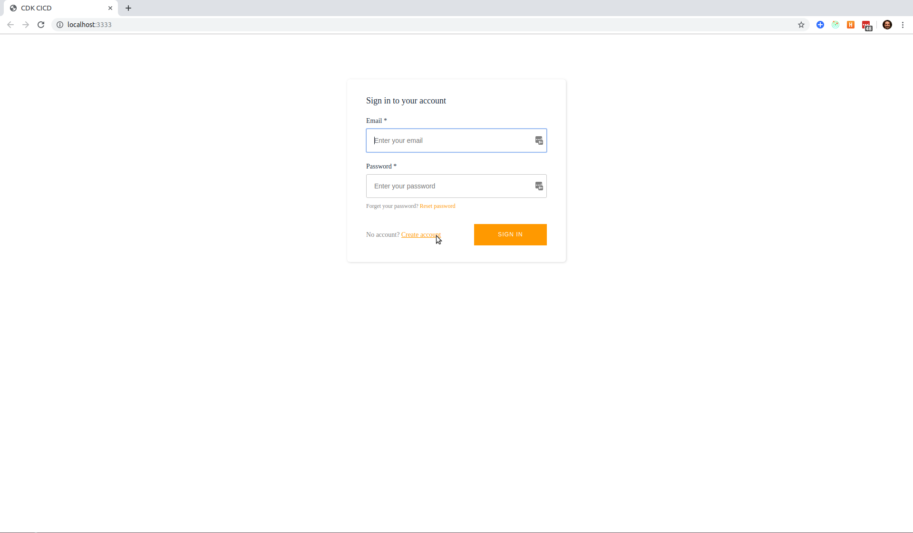

# A Serverless Project

## Blog Post #8 - React / Redux / React Router / Amplify

I'll be using React, Redux, and React Router for the front end.

As always, you can skip over all of this by just copying the directory into your project

```sh
cd ~/projects
rm -rf my-cdk-project/*
cp -R serverless-cdk-cicd/08/. my-cdk-project/
```

## Steps

1. [Launch local build](#launch)
1. [Generate config file](#config)
1. [Add Amplify](#amplify)
1. [Redux](#redux)
1. [Test it out](#test)

### Step 1: Launch local build <a name="launch"></a>

It looks like I forgot to add a few dependencies as I was setting up the project. So, make sure you're at the root of your directory (not in the `cdk` folder) and run

```sh
npm i react-scripts aws-amplify aws-amplify-react connected-react-router
npm i typescript @types/react @types/react-dom @types/react-redux @types/react-router-dom @types/react-router @types/node --save-dev
```

Then I'll add the following 3 nodes in the "scripts" piece of the root directory's [package.json](package.json) file.

```json
{
  "build": "react-scripts build",
  "start": "PORT=3333 react-scripts start",
  "eject": "react-scripts eject"
}
```

Then we can run

```sh
npm run start
```

And this should show us our skeleton site locally at http://localhost:3333.

### Step 2: Generate config file <a name="config"></a>

Since the CDK spits out the CloudFormation Outputs on the command line, we can send that output to a text file to capture it, parse it, and feed it into our front end.

I created [parseAwsOutputs.js](parseAwsOutputs.js) to write a config.js file into the src directory. To make this work, we'll need to `cdk deploy` again. Since our stacks haven't changed, there won't be any changes pushed to our environment, but it will still spit out the CloudFormation Outputs.

```sh
cd cdk
cdk deploy TodoCognito --require-approval never &> ../cdkdeployresult_cognito.txt
cdk deploy TodoAppsync --require-approval never &> ../cdkdeployresult_appsync.txt
cd ..
echo "export default {};" > src/config.js
node parseAwsOutputs.js src/config.js
```

### Step 3: Add Amplify <a name="amplify"></a>

[Amplify](https://aws-amplify.github.io/docs/) is a project from AWS whose goal is to make it easy and fast to build mobile apps. For this project, we'll be using their API Library and some of their pre-baked React Components.

#### src/index.tsx

We're loading in the `AppWithAuth` instead of the `App` component now.

#### src/AppWitAuth.jsx

Amplify provides the [withAuthenticator](https://aws-amplify.github.io/docs/js/authentication#using-withauthenticator-hoc) High Order Component. This greatly simplifies how to bake authentication into your React app.

We're importing a few out-of-the-box Amplify components, but I wanted to customize a couple of them. So I went into the source code for the `MySignUp` and `MySignIn` components. For both of them, I wanted it to prompt for `email` instead of `username`. And for `MySignUp`, I wanted the user to be automatically logged in after confirming their email.

`Amplify.configure` provides a way to pass your infrastructure information into the Amplify framework. As you can see, I'm importing the config file that I generated up in [Step 2](#config) and passing those values on to Amplify.

### Step 4: Redux <a name="redux"></a>

Honestly, I'm not sure what all of this does. I've copied it in, but I don't understand it well. Sorry.

Check out the [Redux docs](https://redux.js.org/) for more help.

### Step 5: Test it out <a name="test"></a>

You should be able to visit http://localhost:3333 and see something like this


Now, our local build is connected to all that AWS infrastructure that we set up.

You can try using the existing `admin@example.com` (`Passw0rd!`) account. It will kinda work, but not fully because the email address hasn't been verified. So let's just create a new user.

Click on `Create Account` to create a new user. Enter your email address, a password, and some info for `first name` and `last name`. That should trigger Cognito to send you and email with a verification code. Find that email, put it in the next prompt, and you should be logged into your site!

### Conclusion <a name="conclusion"></a>

There was a good bit of magic in this one. Sorry about that. If you've got a good explanation for Redux, please submit a PR for this README.

But we can now see all of our pieces coming together in the browser. That's quite fun.

Feel free to @ me on [twitter](https://twitter.com/murribu) or file an issue/pr on this repo if you have any questions.
