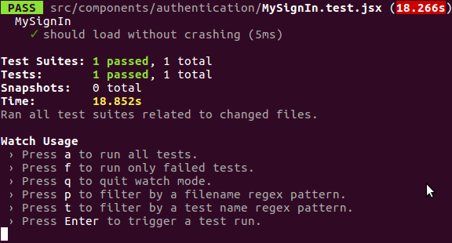
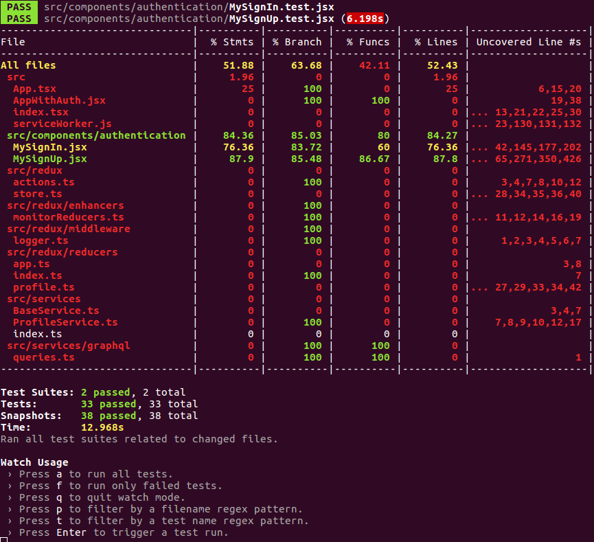

# A Serverless Project

## Blog Post #10 - Enzyme Testing

[Enzyme](https://github.com/airbnb/enzyme) is a JavaScript Testing utility for React that makes it easier to test your React Components' output.

As always, you can skip over all of this by just copying the directory into your project

```sh
cd ~/projects
rm -rf my-cdk-project/*
cp -R serverless-cdk-cicd/10/. my-cdk-project/
```

## Steps

1. [Install dependencies](#install)
1. [setupTests.js](#setup)
1. [Quick Simple Test](#simple)
1. [Copy tests from Amplify](#copy)
1. [Coverage](#coverage)
1. [Conclusion](#conclusion)

### Step 1: Install dependencies <a name="install"></a>

```sh
npm i --save-dev enzyme enzyme-adapter-react-16
```

### Step 2: setupTests.js <a name="setup"></a>

We'll create a [src/setupTests.js](src/setupTests.js) file to pull in our dependencies and set some global functions.

[Here is more information about how this works](https://create-react-app.dev/docs/running-tests#src-setuptestsjs).

### Step 3: Quick Simple Test <a name="simple"></a>

We'll create a [src/components/authentication/MySignIn.test.jsx]() file just to see it run.

```js
import React from "react";
import MySignIn from "./MySignIn";

describe("MySignIn", () => {
  it("should load without crashing", () => {
    const wrapper = shallow(<MySignIn />);
  });
});
```

[Here's more info about shallow rendering](https://github.com/airbnb/enzyme/blob/master/docs/api/shallow.md).

Now at our root directory, we can

```sh
npm run test
```

And we should see something like this:


### Step 4: Copy tests from Amplify <a name="copy"></a>

Amplify's tests are in [their github repo](https://github.com/aws-amplify/amplify-js/tree/master/packages/aws-amplify-react/__tests__/Auth). So for my custom components, I just copied what they have and tweaked them according to the customizations I mentioned in [Step 8.3](../08#amplify).

For [MySignIn.test.jsx](src/components/authentication/MySignIn.test.jsx), I made it use `email` instead of `username` for logging in.

For [MySignUp.test.jsx](src/components/authentication/MySignUp.test.jsx), I combined their `SignUp` and `ConfirmSignUp` components.

### Step 5: Coverage <a name="coverage"></a>

If we add `--coverage` to the end of our "test" command in the [package.json](package.json) file and run `npm run test` again, it will generate a coverage report for us.



51.88% isn't great. Ha! But it's a start. I should probably test my Redux stuff too, huh?

### Conclusion

We now have a place where we can define our front end functionality via automated tests! Hooray!

It should be clear that this is a weak area in my knowledge. So if you have something you'd like to add, please create a PR.

Feel free to @ me on [twitter](https://twitter.com/murribu) or file an issue/pr on this repo if you have any questions.
