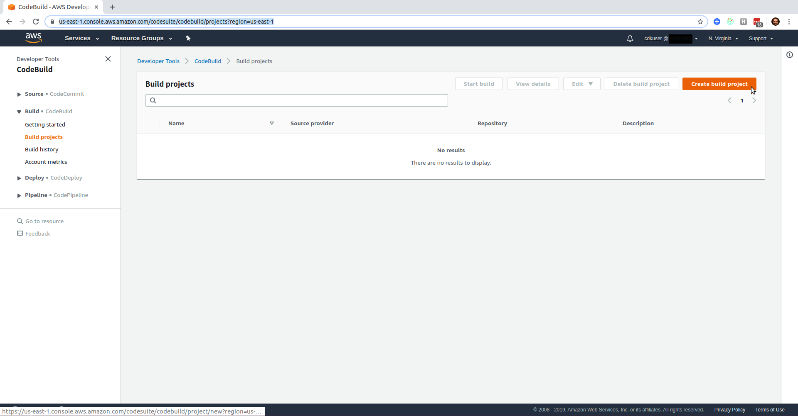
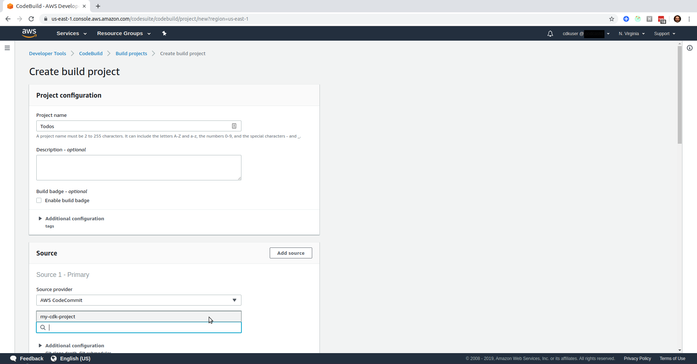
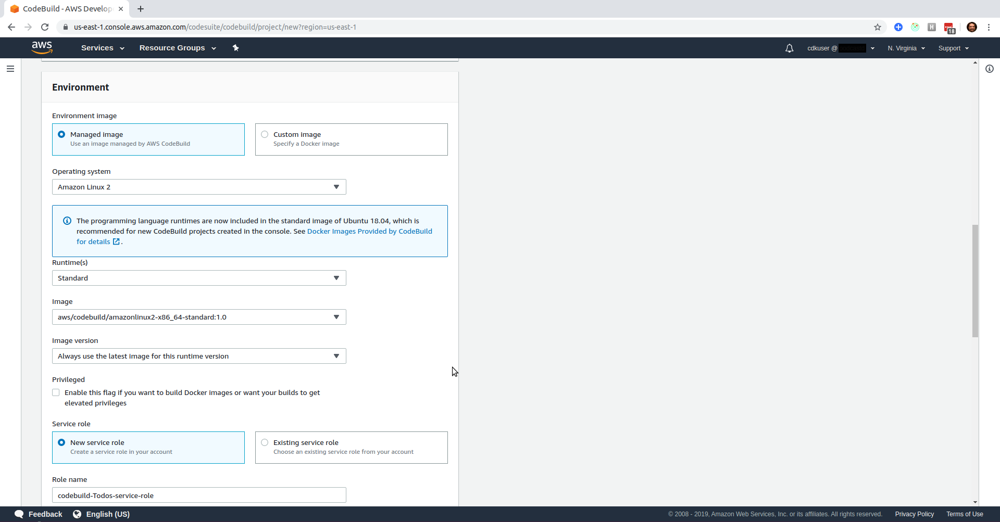
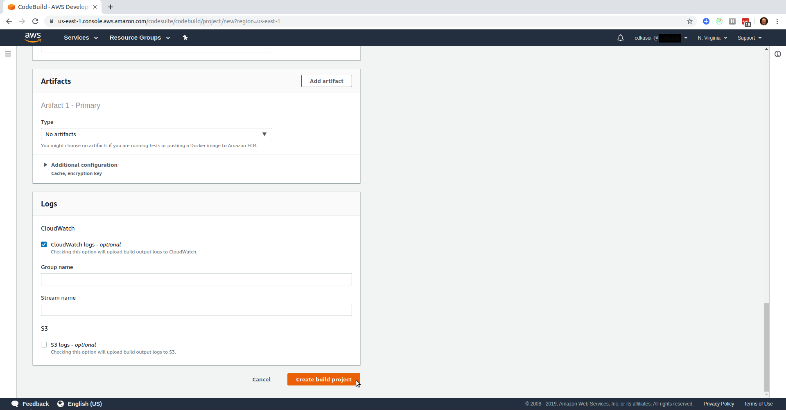
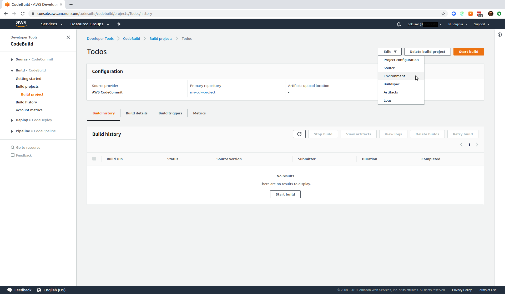
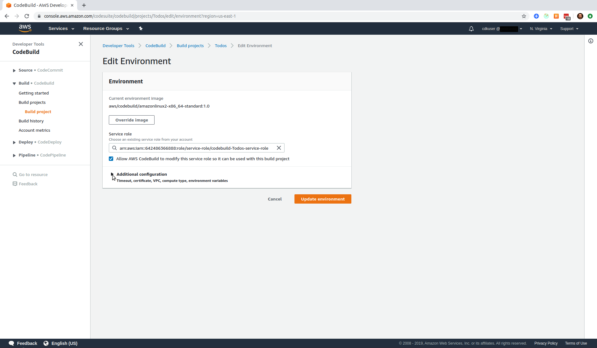
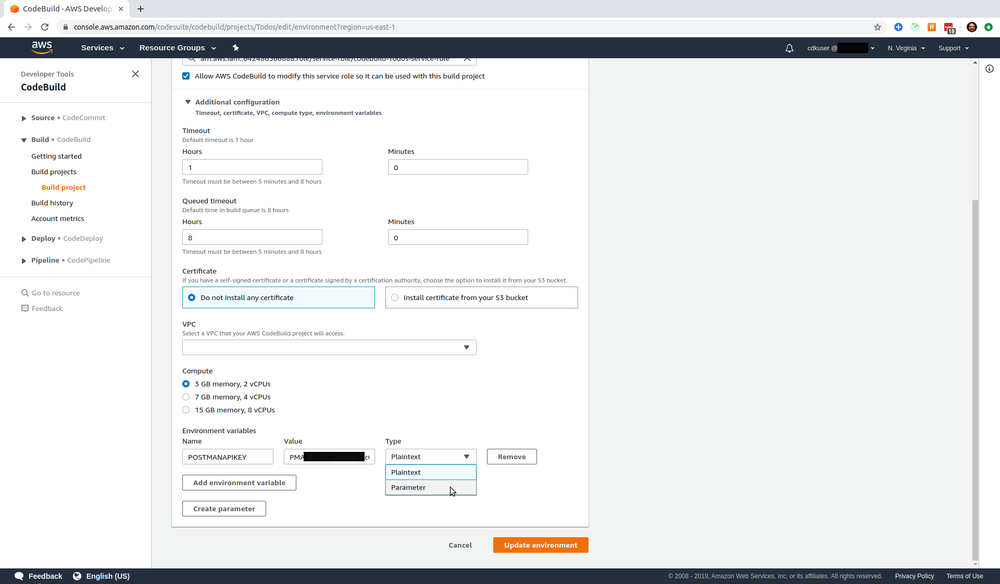

# A Serverless Project

## Blog Post #12 - CodeBuild

[CodeBuild](https://aws.amazon.com/codebuild/) is AWS's fully managed continuous integration service that compiles source code, runs tests, and produces software packages that are ready to deploy. If you've used TravisCI or CircleCI, it's a very similar service.

In this final (for now) post, we're going to set up CodeBuild to build out a `Testing` environment for our infrastructure and run our back-end and front-end tests.

As always, you can skip over all of this by just copying the directory into your project

```sh
cd ~/projects
rm -rf my-cdk-project/*
cp -R serverless-cdk-cicd/12/. my-cdk-project/
```

## Steps

1. [Create a Build](#build)
1. [Edit the CodeBuild role](#iam)
1. [Create a config file for cdk stacks](#config)
1. [Store your Postman API Key as a secret in CodeBuild](#secret)
1. [Create a buildspec.yml file](#buildspec)
1. [Run it](#run)

### Step 1: Create a Build <a name="build"></a>

Visit your [CodeBuild Console](https://us-east-1.console.aws.amazon.com/codesuite/codebuild/projects?region=us-east-1) and click on Create New Build


Give your build a name. (I chose `Todos`). Then click in the `Repository` input box, and you should see the CodeCommit repository that you set up way back in [Step 1](#codecommit). Select that repo.


Then scroll down and click in the `Branch` input box and select `master`. This is a terrible idea for CICD'ing. If you flesh the project out a bit more, you should have a develop branch and/or feature branches. But this project is going pretty long, so we're going to just show that this can work for now.


Next, select your environment by choosing the `Amazon Linux 2` Operating System and the `Standard` runtime and the only Image that's available.


Note the Service Role that is created for the build. We'll need that in the next step. Mine is `codebuild-Todos-service-role`.

Leave everything else alone with their defaults, scroll to the bottom, and click `Create build project`.


### Step 2: Edit the CodeBuild role <a name="iam"></a>

Visit your [IAM Console](https://console.aws.amazon.com/iam/home?region=us-east-1#/roles). Remember that Service Role that was created just a minute ago? Type that into the search box and click on the role that you find.


Click on Attach Policy.


Select Administrator Access and then click Attach Policy.

WARNING - This is not `AWS Best Practices` because your role should only have access to what they need. Giving it Administrator Access means it can use any AWS service on your behalf. Technically, we should spell out each service that the role should have access to

### Step 3: Create a config file for cdk stacks <a name="config"></a>

In order to separate your dev environment from your testing environment, we're going to create a [cdk/config.ts](cdk/config.ts) file where we can set a name for our environment. Then we can import that config file into our [cdk/bin/cdk.ts](cdk/bin/cdk.ts) file to namespace our stacks.

```js
import config from "../config";
const proj = config.projectname;
const env = config.environment;
```

Then change all the stack names to use the `proj` and `env` variables.
For example, "TodoDynamoDb" becomes `${proj}${env}DynamoDb`

### Step 4: Store your Postman API Key as a secret in CodeBuild <a name="secret"></a>

We're going to need our Postman API Key available to us in the build, so we should store it as a secret environment variable.

Find your Build in your [CodeBuild Console](https://us-east-1.console.aws.amazon.com/codesuite/codebuild/projects?region=us-east-1) and click on it. Then click Edit, and Environment


Then click on "Additional configuration"


Scroll to the bottom and enter `POSTMANAPIKEY` for the variable name, enter your Postman API Key from [Step 11](../11#api-key), and select Parameter (instead of Plaintext).


Then click `Update environment`.

### Step 5: Create a buildspec.yml file <a name="buildspec"></a>

To tell CodeBuild what to do, we need to create a [buildspec.yml](buildspec.yml) file. For more info about how to formulate a buildspec file, [click here](https://docs.aws.amazon.com/codebuild/latest/userguide/build-spec-ref.html).

During the install phase, we'll just need to install newman and download our Postman tests.

During the build phase, we'll want to do 4 things:

- Copy our [cdk/config.example.ts](cdk/config.example.ts) file to be just `cdk/config.ts`, and then replace "Dev" with "Testing" so that there is no collision on our stack names
- Run the [cicd-deploy.sh](cicd-deploy.sh) file. That bash script does the following
  - Installs dependencies for our cognito-triggered lambda
  - Builds, synths, and deploys our CDK Stacks and stores the outputs in the appropriate `txt` files
  - Initializes our [src/config.ts](src/config.ts) file
  - Parses the CDK output files
  - Runs the generated bash file to set config variables from our stack outputs
  - Creates a test user in Cognito
  - Confirms our test user in Cognito
  - Runs the node script to get a jwt for our user, and store that jwt (along with other variables) in a config
- Run the newman command to run our Postman tests.
- Run the enzyme tests

That process should return a failure or success to CodeBuild that we can then use to determine whether or not our code is ready for deployment! Yay!

### Step 6: Run it <a name="run"></a>

You should be able to

```sh
cd ~/projects
rm -rf my-cdk-project/*
cp -R serverless-cdk-cicd/12/. my-cdk-project/
git add .
git commit -m "running buildspec"
git push
```

and then watch it go in your [CodeBuild Console](https://us-east-1.console.aws.amazon.com/codesuite/codebuild/projects?region=us-east-1)

### Conclusion

We made it! We now have a process runner building out our infrastructure, running our tests, and telling us whether they failed or succeeded! Yay!

Obviously, there are next step to take - like actually building out some of the app, and/or making it deploy to Production when the tests pass. But I'm going to leave it here for now. Perhaps I'll take those next steps at some point, but this is where I'll leave you.

As always if anything is unclear, @ me on [twitter](https://twitter.com/murribu) or file an issue/pr on this repo.
